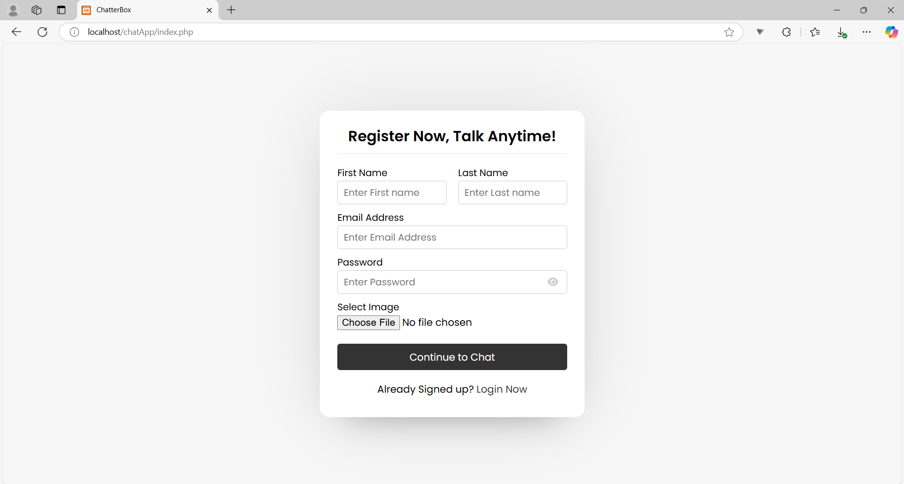
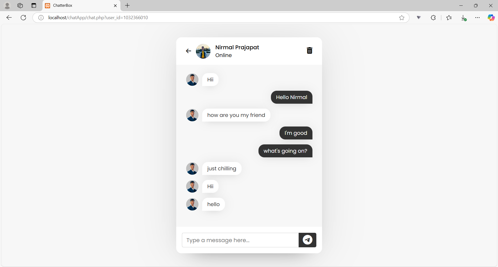
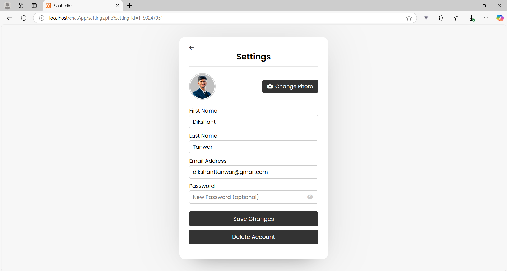
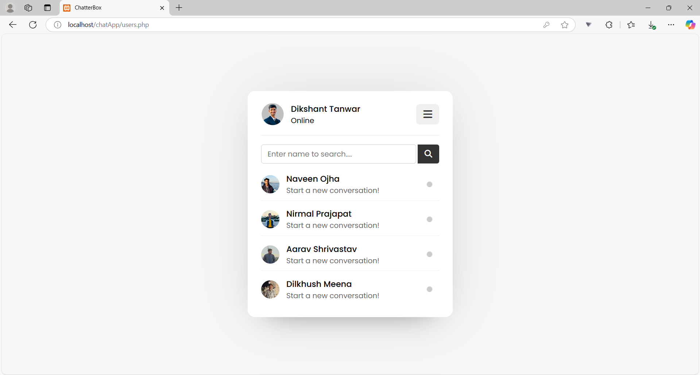

# 🗨️ ChatterBox - Real-Time Chat Application

ChatterBox is a real-time chat application built using **PHP, JavaScript, MySQL, HTML, and CSS**. It allows users to **communicate instantly** with a clean and user-friendly interface. 🚀

## 🌟 Features
✅ **Real-time Messaging** – Instant communication between users  
✅ **User Authentication** – Secure login and registration  
✅ **Responsive UI** – Works smoothly on desktop & mobile  
✅ **Efficient Database Handling** – Powered by MySQL  
✅ **Secure & Scalable** – Built with security best practices  

## 📸 Screenshots
### 🔹 Login Page


### 🔹 Signup Page


### 🔹 Chat Interface


### 🔹 Settings Interface


### 🔹 User Dashboard


## 🚀 Tech Stack
- **Frontend:** HTML, CSS, JavaScript  
- **Backend:** PHP  
- **Database:** MySQL  

## 🎯 Installation Guide

### 🔧 Prerequisites
Make sure you have:  
- **PHP** installed (v7.4+ recommended)  
- **MySQL** installed and running  
- A local server environment like **XAMPP, WAMP, or MAMP**  

### 📥 Steps to Run
1️⃣ Clone this repository:  
   ```bash
   git clone https://github.com/yourusername/ChatterBox.git
   ```  
2️⃣ Move to the project directory:  
   ```bash
   cd ChatterBox
   ```  
3️⃣ Import the database:  
   - Open **phpMyAdmin**  
   - Create a new database named `chatterbox_db`  
   - Import the `chatterbox.sql` file (provided in the repo)  

4️⃣ Configure the database connection in `config.php`:  
   ```php
   $host = "localhost";
   $user = "root";
   $password = "";
   $database = "chatterbox_db";
   ```  

5️⃣ Start a local server (using XAMPP or any PHP server) and open the project in your browser:  
   ```
   http://localhost/ChatterBox/
   ```  

## 🤝 Contributing
Contributions are welcome! Feel free to **fork** the repository, submit a **pull request**, or report an issue.  

## 📜 License
This project is **open-source** under the MIT License.  

## 📬 Contact
For any queries, reach out to me on **LinkedIn**: [Your LinkedIn Profile](https://www.linkedin.com/in/dikshanttanwar/)
